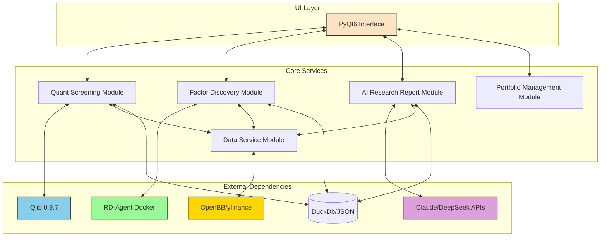
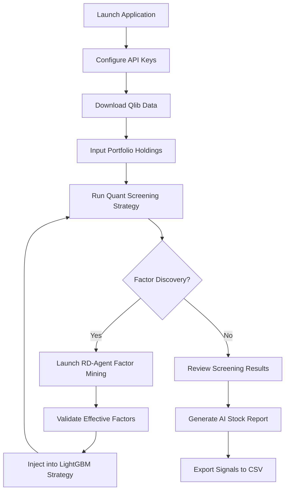

# QuantByQlib

> **An AI-Powered Quantitative Decision Support Desktop App for Retail Investors (US / CN / HK / TW / JP / KR Stocks & Crypto)**

[中文概览](readme.md)

- QuantByQlib is a **zero mock data**, **open-source ecosystem integrated**, and **retail-friendly** quantitative trading assistant. 
- It supports **custom universe selection**, **machine learning**, and **stock screening** across both light and heavy data scopes. 
- The application facilitates dataset initialization for **US Stocks**, **A-Shares**, and **Crypto (WIP)**, with dynamic updates for recent data to lower the barrier to entry. 
- This is not just another **backtesting framework**; it is an **end-to-end system designed to translate academic-grade quantitative models into actionable trading signals**.

---

## ✨ Core Features

### 🧠 AI Researcher (RD-Agent Factor Discovery)
* **Automated Factor Mining**: Integrates RD-Agent to autonomously generate factor hypotheses via DeepSeek LLM within a Docker container.
* **Dual IC Validation**: Employs container-side preliminary screening followed by host-side Qlib empirical cross-sectional IC (Spearman) testing to ensure factor efficacy.
* **Dynamic Injection**: Validated factors are automatically injected into LightGBM stock picking strategies, creating a closed loop from "Discovery → Validation → Live Implementation".

### 🤖 Intelligent Investment Research (Claude + DeepSeek)
* **Dual LLM Fallback**: Utilizes Claude 3.5 (primary) + DeepSeek (overload fallback) to generate streaming AI reports for individual stocks.
* **Five-Dimensional Analysis**: Parallel acquisition of Alpha158 technical signals, K-line patterns, fundamentals, sentiment, and six-dimensional technical scores.
* **Data Integrity**: Prompts enforce strict constraints on LLMs to prevent data fabrication; missing fields are explicitly marked as "Insufficient Data".

### 🚀 Industrial-Grade Quantitative Screening (Qlib 0.9.7)
* **5 Built-in Strategies**: Supports LightGBM, LSTM, GRU, Market Adaptive, and Full Market Deep Learning models.
* **Custom Factor Injection**: Uniquely supports dynamically splicing RD-Agent discovered Alpha factors into the LightGBM feature set.
* **24h Model Cache**: Identical parameters yield results in seconds via caching, drastically improving interactive experience.

### 🛡️ Robust Engineering Architecture
* **Zero Mock Principle**: Any data source failure results in a "No Data Available" display—no fake information is ever shown.
* **Multi-Source Degradation Chain**: Alpha Vantage → yfinance → Local Calculation, ensuring continuity of market data.
* **Qt Multithreading**: All I/O and model inference are processed via QRunnable, guaranteeing a non-blocking UI.

---

## 🏗️ Tech Stack

| Layer | Core Technologies |
| :--- | :--- |
| **UI** | PyQt6 (Dark Theme) + QStackedWidget |
| **Quant Engine** | Qlib 0.9.7 (Microsoft Open Source) |
| **Data Sources** | OpenBB Platform (FMP / Finnhub / Alpha Vantage) + yfinance |
| **AI Factors** | RD-Agent (Docker) + DeepSeek API |
| **NLP** | VADER (Fast) + DistilBERT (Accurate) + Claude / DeepSeek |
| **Database** | SQLite (Positions / Targets) + JSON (Factor Sessions / Validation Library) |
| **Concurrency** | ThreadPoolExecutor + QThreadPool |

---

## System Architecture



---

## 📦 Quick Start

### 1️⃣ Environment Setup
```bash
git clone https://github.com/delon-xie/QuantByQlib.git
cd QuantByQlib
pip3 install -r requirements.txt
```

### 2️⃣ Configure API Keys (`.env`)
```ini
# Required
ANTHROPIC_API_KEY=sk-ant-xxxx      # For Claude AI Reports
DEEPSEEK_API_KEY=sk-xxxx           # For Factor Discovery + LLM Fallback

# Optional (Improves Data Quality)
FMP_API_KEY=xxxx
FINNHUB_API_KEY=xxxx
ALPHA_VANTAGE_API_KEY=xxxx
```

### 3️⃣ Pull Docker Image (Factor Discovery)
```bash
docker pull msrarambler/rd-agent:latest
```

### 4️⃣ Download Qlib Data (Recommended)
```bash
python3 main.py
# Navigate to 「⚙️ Settings」→「Data Management」→「Download US Data」
```

### 5️⃣ Launch Application
```bash
python3 main.py
```

---

## 🧭 Typical Workflow

1. **Input Holdings** → Dashboard displays real-time P&L.
2. **Run Quant Screening** (Growth Stock LightGBM is fastest).
3. **Factor Discovery** → Launch RD-Agent → Inject valid factors.
4. **View Results** → Check details in the right-hand stock panel.
5. **Click "🤖 AI Report"** → Stream a six-chapter investment research report.
6. **Trading Signals Page** → Export BUY/SELL signals as CSV.

---

## 📂 Project Structure (Simplified)

```
QuantByQlib/
├── main.py                 # Application Entry Point
├── ui/                     # PyQt6 Pages & Components
├── workers/                # Qt Background Threads (Screening/Analysis/Factor)
├── strategies/             # Qlib Strategies + Factor Injector
├── stock_analysis/         # Five-Dimensional Analysis + LLM Reports
├── rdagent_integration/    # RD-Agent Docker Bridge
├── data/                   # OpenBB / Qlib Unified Interface
├── portfolio/              # Holdings & Risk Analysis
└── services/               # Report Writing & Path Management
```
## Usage Guide




## Data Directory Structure

```
.
├── cn_data/
│   ├── calendars/
│   ├── features/
│   └── instruments/
│       ├── all.txt
│       ├── csi300.txt
│       ├── csi500.txt
│       ├── csi800.txt
│       ├── csi1000.txt
│       └── csiiall.txt
│       └── userdefine....txt
├── hk_data/
│   ├── calendars/
│   ├── features/
│   └── instruments/
│       ├── all.txt
│       ├── core.txt
│       ├── HSCEI.txt
│       ├── hsci.txt
│       ├── hsi.txt
│       └── tech100.txt
│       └── userdefine....txt
└── us_data/
    ├── calendars/
    ├── features/
    └── instruments/
        ├── all.txt
        ├── nasdaq100.txt
        └── sp500.txt
        └── userdefine....txt
```

## Screenshots

### Dashboard
!images/dashboard.png

### Quant Screening - Deep Learning Integration (LSTM)
!images/stock_screening_lstm.png

### Quant Screening - Results (Machine Learning / Deep Learning)
!images/screening_result_4.png

### Quant Screening - Deep Learning Integration (LightGBM)
!images/stock_screening_lightgbm.png

### Quant Screening - Six-Dimensional Technical Analysis
!images/screening_result.png
!images/screening_result_2.png
!images/screening_result_3.png

### Trading Signals
!images/screening_signal.png

### Strategy Backtesting
!images/backtest.png
!images/backtest2.png

### Configuration & Logs
!images/config_download.png
!images/run_log.png

---

## ⚠️ Disclaimer
This project is intended for **educational and research purposes only** and does not constitute financial advice. Quantitative strategies carry risk of drawdown; please make rational decisions.

---

📘 Detailed documentation can be found in the `docs/` directory.  
🐞 Bug reports and feature requests are welcome via GitHub Issues.