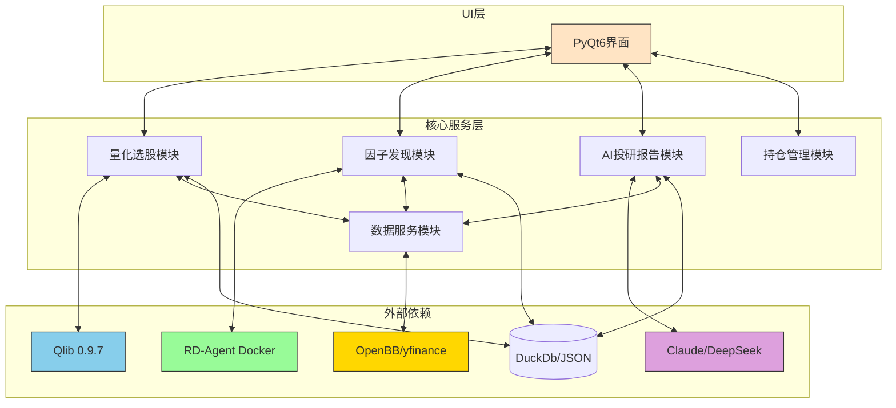
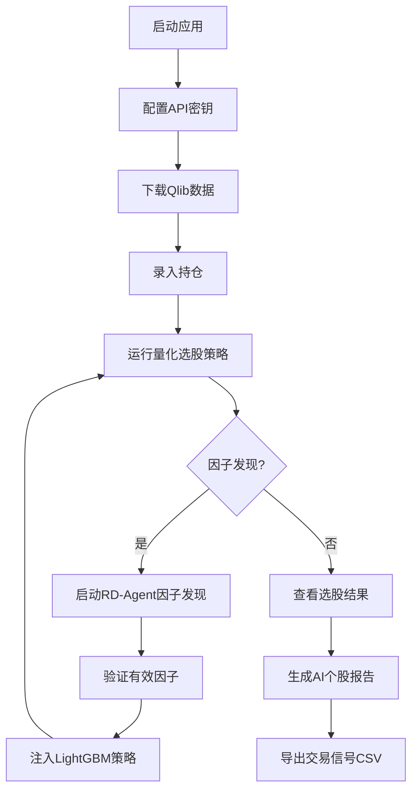

# QuantByQlib

> **面向散户的 AI 量化辅助决策桌面应用（美股 / A股 / 港股 / 台股 / 日股 / 韩股/ Crypto）**

QuantByQlib 是一个**零 Mock 数据**、**复用开源生态**、**散户友好**的量化交易辅助工具。  
支持用户**自定义的选股范围**的数据更新、机器学习和选股，可实现轻数据范围和重度数据范围。
支持 **美股** ｜ **A股** ｜ **Crypto（实现中）** 数据集打包初始化。
支持最近数据的动态更新，降低用户使用门槛。
它并非另一个回测框架，而是一个**将学术论文级量化模型落地为可执行交易信号的端到端系统**。

---

## ✨ 核心特色

### 🧠 AI 研究员（RD-Agent 因子发现）
* **自动因子挖掘**：集成 RD-Agent，通过 Docker 调用 DeepSeek LLM 自主生成因子假设。
* **双重 IC 验证**：容器内初筛 + 宿主机 Qlib 实测截面 IC（Spearman），确保因子有效。
* **动态注入**：通过验证的因子自动注入 LightGBM 选股策略，实现“发现 → 验证 → 实盘化”闭环。

### 🤖 智能投研（Claude + DeepSeek）
* **双 LLM 降级**：Claude 3.5（主力）+ DeepSeek（过载降级），生成流式个股 AI 报告。
* **五维分析**：并行获取 Alpha158 技术信号 / K线 / 基本面 / 情绪 / 六维技术评分。
* **数据诚信**：Prompt 强制约束 LLM 不得捏造数据，缺失字段如实标注“数据不足”。

### 🚀 工业级量化选股（Qlib 0.9.7）
* **5 种内置策略**：LightGBM / LSTM / GRU / 市场自适应 / 全市场深度学习。
* **自定义因子注入**：唯一支持将 RD-Agent 发现的 Alpha 因子动态拼接到 LightGBM 特征集。
* **24h 模型缓存**：相同参数秒级出结果，大幅提升交互体验。

### 🛡️ 稳健工程架构
* **零 Mock 原则**：任意数据源失败 → 显示「暂无数据」，杜绝虚假信息。
* **多源降级链**：Alpha Vantage → yfinance → 本地计算，保障行情连续性。
* **Qt 多线程**：所有 IO / 模型推理放入 QRunnable，UI 永不卡顿。

---

## 🏗️ 技术栈

| 层级 | 核心技术 |
|----|----|
| **UI** | PyQt6（暗色主题）+ QStackedWidget |
| **量化引擎** | Qlib 0.9.7（微软开源） |
| **数据源** | OpenBB Platform（FMP / Finnhub / Alpha Vantage）+ yfinance |
| **AI 因子** | RD-Agent（Docker）+ DeepSeek API |
| **NLP** | VADER（快速）+ DistilBERT（精准）+ Claude / DeepSeek |
| **数据库** | SQLite（持仓 / 目标）+ JSON（因子会话 / 验证库） |
| **并行** | ThreadPoolExecutor + QThreadPool |

---

## 技术架构



---

## 📦 快速开始

### 1️⃣ 环境准备
```bash
git clone https://github.com/delon-xie/QuantByQlib.git
cd QuantByQlib
pip3 install -r requirements.txt
```

### 2️⃣ 配置 API Key（`.env`）
```ini
# 必填
ANTHROPIC_API_KEY=sk-ant-xxxx      # Claude AI 报告
DEEPSEEK_API_KEY=sk-xxxx           # 因子发现 + 降级 LLM

# 可选（提升数据质量）
FMP_API_KEY=xxxx
FINNHUB_API_KEY=xxxx
ALPHA_VANTAGE_API_KEY=xxxx
```

### 3️⃣ 拉取 Docker 镜像（因子发现）
```bash
docker pull msrarambler/rd-agent:latest
```

### 4️⃣ 下载 Qlib 数据（推荐）
```bash
python3 main.py
# 进入「⚙️ 参数配置」→「数据管理」→「下载 US 数据」
```

### 5️⃣ 启动应用
```bash
python3 main.py
```

---

## 🧭 典型使用流程

1. **录入持仓** → 仪表盘实时展示市值 / 盈亏  
2. **运行量化选股**（成长股 LightGBM 最快）  
3. **因子发现** → 启动 RD-Agent → 注入有效因子  
4. **查看选股结果** → 右侧个股详情面板  
5. **点击「🤖 AI 报告」** → 流式生成六章节投研报告  
6. **交易信号页** → 导出 BUY/SELL CSV  

---

## 📂 项目结构（精简）

```
QuantByQlib/
├── main.py                 # 应用入口
├── ui/                     # PyQt6 页面与组件
├── workers/                # Qt 后台线程（选股/分析/因子）
├── strategies/             # Qlib 策略 + 因子注入器
├── stock_analysis/         # 五维分析 + LLM 报告
├── rdagent_integration/    # RD-Agent Docker 桥接
├── data/                   # OpenBB / Qlib 统一入口
├── portfolio/              # 持仓 & 风险分析
└── services/               # 报告写入 & 路径管理
```

## 用户使用流程



## 数据目录

```
.
├── cn_data/
│   ├── calendars/
│   ├── features/
│   └── instruments/
│       ├── all.txt
│       ├── csi300.txt
│       ├── csi500.txt
│       ├── csi800.txt
│       ├── csi1000.txt
│       └── csiiall.txt
│       └── userdefine....txt
├── hk_data/
│   ├── calendars/
│   ├── features/
│   └── instruments/
│       ├── all.txt
│       ├── core.txt
│       ├── HSCEI.txt
│       ├── hsci.txt
│       ├── hsi.txt
│       └── tech100.txt
│       └── userdefine....txt
└── us_data/
    ├── calendars/
    ├── features/
    └── instruments/
        ├── all.txt
        ├── nasdaq100.txt
        └── sp500.txt
│       └── userdefine....txt
```


## 典型界面


---

## 仪表板

!images/dashboard.png

---

## 量化选股 - 深度学习集成（LSTM）

!images/stock_screening_lstm.png

---

## 量化选股 - 选股结果（机器学习 / Deep Learning）

!images/screening_result_4.png

---

## 量化选股 - 深度学习集成（Deep Learning）

!images/stock_screening_deeplearning.png

---

## 量化选股 - 深度学习集成（LightGBM）

!images/stock_screening_lightgbm.png

---

## 量化选股 - 选股结果（机器学习 · 六维技术分析）

!images/screening_result.png

!images/screening_result_2.png

!images/screening_result_3.png

---

## 量化选股 - 交易信号

!images/screening_signal.png

---

## 量化选股 - 配置下载数据

!images/config_download.png

!images/config_download_2.png

---

## 量化选股 - 运行日志

!images/run_log.png

---

## ⚠️ 免责声明
本项目仅供**教育与研究**使用，不构成投资建议。量化策略存在回撤风险，请理性决策。

---

📘 详细文档请参考 `docs/` 目录  
🐞 问题反馈欢迎提交 GitHub Issue