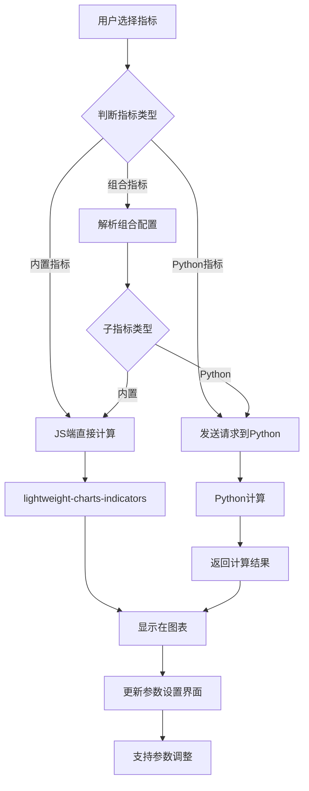

## 一、功能需求

### 1.1 核心能力分层

```
├── 第1层：内置指标库（lightweight-charts-indicators）
│   ├── 82个标准指标
│   ├── 317个社区指标
│   ├── 44个K线形态
│   └── PineScript v6兼容
│
├── 第2层：Python扩展指标
│   ├── 用户自定义指标（如PROFILE）
│   ├── 复杂组合指标
│   └── 专业分析指标
│
├── 第3层：增强功能
│   ├── 绘图基元支持（线、框、标签、表格）
│   ├── 多时间框架分析
│   └── 高级可视化
│
└── 第4层：用户交互
    ├── 智能参数配置
    ├── 指标模板管理
    └── 工作流自动化
```

### 1.2 核心功能模块

#### 1.2.1 指标系统
- **内置指标**：直接使用 lightweight-charts-indicators 的 446 个指标
- **Python指标**：用户自定义的复杂指标计算
- **组合指标**：多个指标的组合展示和联动
- **K线形态**：44 种蜡烛图形态识别

#### 1.2.2 可视化系统
- **主图**：K线 + 叠加指标
- **副图**：技术指标展示
- **绘图工具**：线、框、标签、表格等绘制
- **多视图**：支持多个副图同时显示

#### 1.2.3 交互系统
- **右侧面板**：常用指标、高级指标、参数设置
- **参数配置**：动态参数调整
- **状态管理**：保存/恢复分析状态
- **导出分享**：图表截图、配置导出

## 二、技术架构设计

### 2.1 架构图

```
PyQt6 (Python)                             JavaScript/HTML
┌─────────────────┐                       ┌─────────────────┐
│ TradingView     │                       │  Web 渲染层     │
│ AdvanceWidget   │                       │  - lightweight- │
├─────────────────┤                       │    charts 5.2.0 │
│ 数据注入层      │◄─── 数据/配置 ────►│  - oakscriptjs  │
│ - 原始数据       │                       │  - indicators   │
│ - 自定义指标     │                       ├─────────────────┤
├─────────────────┤                       │ 指标计算层      │
│ 指标扩展层      │                       │  - 446内置指标  │
│ - 复杂指标计算   │◄─── 计算结果 ────►│  - 实时计算      │
│ - 组合指标逻辑   │                       ├─────────────────┤
├─────────────────┤                       │ UI交互层        │
│ 配置管理层      │◄─── 配置/状态 ────►│  - 右侧面板      │
│ - 用户偏好       │                       │  - 参数表单     │
│ - 模板管理       │                       │  - 主题系统     │
└─────────────────┘                       └─────────────────┘
```

### 2.2 Python端职责（简化但核心）

```python
# Python端主要职责
1. 数据提供者
   - 从各种数据源加载数据
   - 数据清洗和预处理
   - 实时数据更新

2. 自定义指标计算
   - PROFILE等复杂指标
   - 组合指标逻辑
   - 专业分析算法

3. 配置管理
   - 用户偏好设置
   - 指标模板
   - 工作流配置

4. 桥接通信
   - 数据传输
   - 状态同步
   - 事件转发
```

### 2.3 JavaScript端职责（增强）

```javascript
// JavaScript端职责
1. 图表渲染
   - lightweight-charts核心
   - 多图表管理
   - 响应式布局

2. 内置指标计算
   - 446个技术指标
   - 实时计算和显示
   - 性能优化

3. 用户交互
   - 完整的UI系统
   - 参数配置界面
   - 绘图工具

4. 状态管理
   - 当前分析状态
   - 用户操作历史
   - 本地存储
```

## 三、详细功能设计

### 3.1 指标分类管理

```javascript
// 指标分类策略
const indicatorCategories = {
    // 第1类：直接使用的内置指标（由JS端完全处理）
    builtin: {
        // 移动平均类
        moving_averages: ['SMA', 'EMA', 'WMA', 'HMA', 'LSMA', 'ALMA', ...],
        
        // 振荡指标类
        oscillators: ['RSI', 'MACD', 'Stochastic', 'CCI', 'WilliamsR', ...],
        
        // 趋势指标类
        trend: ['ADX', 'Ichimoku', 'ParabolicSAR', 'SuperTrend', ...],
        
        // 波动率类
        volatility: ['ATR', 'BollingerBands', 'StandardDeviation', ...],
        
        // 成交量类
        volume: ['Volume', 'MFI', 'OBV', 'VWAP', ...],
        
        // K线形态
        patterns: ['Doji', 'Hammer', 'Engulfing', 'MorningStar', ...]
    },
    
    // 第2类：Python计算指标（需要Python端计算）
    python_calculated: {
        'PROFILE': {
            description: '年度成交量分布图',
            requires_python: true,
            params: { period: 252 }
        },
        'CUSTOM_MA_COMBO': {
            description: '自定义MA组合',
            requires_python: true
        }
    },
    
    // 第3类：组合指标（JS内置指标的组合）
    combined: {
        'ALL_MAS': {
            indicators: ['SMA_20', 'SMA_50', 'SMA_200', 'EMA_12', 'EMA_26'],
            description: '常用移动平均线组合'
        },
        'MOMENTUM_SUITE': {
            indicators: ['MACD', 'RSI', 'Stochastic'],
            description: '动量指标套件'
        }
    }
};
```

### 3.2 右侧面板设计

#### 全局搜索: 可以用名字或指标进行快速定位

#### Tab 1: 常用指标（快速使用）
- **特点**：一键添加，使用默认参数
- **内容**：40-50个最常用的内置指标
- **交互**：点击即显示，无需配置
- **分组**：
  - 趋势跟踪：SMA(20, 50, 200), EMA(12, 26)
  - 动量分析：RSI, MACD, Stochastic
  - 成交量：Volume, OBV
  - 波动率：Bollinger Bands, ATR

#### Tab 2: 高级指标（完整库）
- **特点**：完整的446个指标库
- **内容**：按类别组织的所有指标
- **交互**：
  - 点击指标 → 跳转到参数设置（默认参数） → 更新主图-副图  → 更新参数 → 更新主图-副图 
  - 支持搜索和筛选
- **分组**：
  - 标准指标 (82个)
  - 社区指标 (317个)
  - K线形态 (44个)
  - Python指标 (自定义)

#### Tab 3: 参数设置
- **特点**：动态参数配置
- **内容**：
  - 当前指标参数表单
  - 参数预设管理
  - 应用/重置按钮
- **智能表单**：
  - 根据指标类型生成不同表单
  - 参数验证和范围限制
  - 实时预览效果

### 3.3 指标计算流程



### 3.4 Python端接口设计

```python
# python/widget.py
class TradingViewAdvanceWidget(QWebEngineView):
    """主组件 - 简化接口设计"""
    
    def __init__(self, parent=None):
        super().__init__(parent)
        self._init_web_engine()
        self._setup_bridge()
        
    def load_data(self, df: pd.DataFrame, **kwargs):
        """加载数据到图表"""
        # 转换为标准格式
        chart_data = self._prepare_chart_data(df)
        
        # 注入到JS
        self.execute_js('setChartData', chart_data)
        
    def add_indicator(self, indicator_config: dict):
        """添加指标"""
        indicator_type = indicator_config.get('type', 'builtin')
        
        if indicator_type == 'builtin':
            # 内置指标 - 直接发送配置
            self.execute_js('addBuiltinIndicator', indicator_config)
            
        elif indicator_type == 'python':
            # Python指标 - 先计算再发送
            result = self._calculate_python_indicator(indicator_config)
            self.execute_js('addPythonIndicator', {
                'config': indicator_config,
                'data': result
            })
            
        elif indicator_type == 'combo':
            # 组合指标 - 分别处理
            self._handle_combo_indicator(indicator_config)
            
    def _calculate_python_indicator(self, config: dict) -> dict:
        """计算Python指标（如PROFILE）"""
        indicator_name = config.get('name')
        
        if indicator_name == 'PROFILE':
            return self._calculate_profile_indicator(config)
        elif indicator_name == 'CUSTOM_MA_COMBO':
            return self._calculate_custom_ma_combo(config)
        # ... 其他自定义指标
        
    def _calculate_profile_indicator(self, config: dict) -> dict:
        """计算PROFILE指标"""
        # 复杂的Python计算逻辑
        period = config.get('period', 252)
        # ... 计算逻辑
        return {
            'type': 'histogram',
            'data': profile_data,
            'options': config.get('options', {})
        }
```

### 3.5 JavaScript端架构

```javascript
// web/js/main.js
class TradingViewApp {
    constructor() {
        // 核心管理器
        this.chartManager = new ChartManager();      // 图表管理
        this.dataManager = new DataManager();        // 数据管理
        this.indicatorManager = new IndicatorManager(); // 指标管理
        this.uiManager = new UIManager();           // UI管理
        
        // 指标计算器
        this.builtinCalculator = new BuiltinCalculator();  // 内置指标
        this.pythonBridge = new PythonBridge();           // Python通信
        
        this._init();
    }
    
    async _init() {
        // 1. 初始化lightweight-charts
        await this._initLightweightCharts();
        
        // 2. 加载内置指标库
        await this._loadIndicatorLibrary();
        
        // 3. 初始化UI系统
        await this._initUISystem();
        
        // 4. 设置Python桥接
        await this._setupPythonBridge();
        
        // 5. 暴露API
        this._exposeAPI();
    }
    
    async _loadIndicatorLibrary() {
        // 加载446个内置指标
        this.builtinIndicators = window.lightweightChartsIndicators;
        
        // 分类整理
        this.indicatorCatalog = this._categorizeIndicators();
        
        // 更新UI面板
        this.uiManager.updateIndicatorPanels(this.indicatorCatalog);
    }
    
    _categorizeIndicators() {
        // 自动分类446个指标
        return {
            standard: this._filterIndicators('standard'),
            community: this._filterIndicators('community'),
            patterns: this._filterIndicators('patterns'),
            
            // 按功能分类
            movingAverages: this._filterByType('ma'),
            oscillators: this._filterByType('oscillator'),
            trend: this._filterByType('trend'),
            volatility: this._filterByType('volatility'),
            volume: this._filterByType('volume')
        };
    }
    
    _exposeAPI() {
        window.TradingViewAPI = {
            // 数据操作
            setData: (data) => this.dataManager.setData(data),
            updateData: (updates) => this.dataManager.update(updates),
            
            // 指标操作
            addBuiltinIndicator: (config) => 
                this.indicatorManager.addBuiltin(config),
            addPythonIndicator: (config) => 
                this.indicatorManager.addPython(config),
            removeIndicator: (name) => 
                this.indicatorManager.remove(name),
            updateIndicator: (name, params) => 
                this.indicatorManager.update(name, params),
                
            // 配置操作
            setTheme: (theme) => this.uiManager.setTheme(theme),
            setLayout: (layout) => this.chartManager.setLayout(layout),
            
            // 状态操作
            getState: () => this._getCurrentState(),
            setState: (state) => this._restoreState(state)
        };
    }
}
```

## 四、文件结构设计

```
TradingViewAdvanceWidget/
├── README.md
├── requirements.txt
├── setup.py
│
├── python/                          # Python端代码
│   ├── __init__.py
│   ├── widget.py                   # 主组件类
│   ├── data_provider.py            # 数据提供者
│   ├── python_indicators/          # Python指标实现
│   │   ├── __init__.py
│   │   ├── profile.py             # PROFILE指标
│   │   ├── combo_indicators.py    # 组合指标
│   │   └── custom_calculators.py  # 自定义计算器
│   ├── config/                     # 配置管理
│   │   ├── __init__.py
│   │   ├── indicator_config.py    # 指标配置
│   │   └── theme_config.py        # 主题配置
│   └── bridge/                     # 通信桥接
│       ├── __init__.py
│       ├── web_channel.py         # WebChannel通信
│       └── message_handler.py     # 消息处理器
│
├── web/                            # 前端代码
│   ├── index.html                  # 主页面
│   ├── css/
│   │   ├── main.css               # 主样式
│   │   ├── panel.css              # 面板样式
│   │   └── theme/                 # 主题样式
│   │       ├── dark.css
│   │       └── light.css
│   │
│   └── js/
│       ├── lib/                    # 第三方库
│       │   ├── lightweight-charts.standalone.production.js
│       │   ├── oakscriptjs.umd.js
│       │   └── lightweight-charts-indicators.umd.js
│       │
│       ├── core/                   # 核心模块
│       │   ├── chart_manager.js   # 图表管理
│       │   ├── data_manager.js    # 数据管理
│       │   ├── indicator_manager.js # 指标管理
│       │   └── event_bus.js       # 事件总线
│       │
│       ├── indicators/             # 指标相关
│       │   ├── builtin_calculator.js  # 内置指标计算
│       │   ├── python_bridge.js   # Python指标桥接
│       │   ├── combo_handler.js   # 组合指标处理
│       │   └── catalog.js         # 指标目录
│       │
│       ├── ui/                     # UI组件
│       │   ├── panel_manager.js   # 面板管理
│       │   ├── tab_system.js      # Tab系统
│       │   ├── param_forms.js     # 参数表单
│       │   ├── toolbar.js         # 工具栏
│       │   └── theme_manager.js   # 主题管理
│       │
│       ├── utils/                  # 工具函数
│       │   ├── logger.js
│       │   ├── validator.js
│       │   └── storage.js
│       │
│       └── main.js                 # 应用入口
│
└── examples/                       # 示例代码
    ├── basic_usage.py
    ├── custom_indicator.py
    └── advanced_config.py
```

## 五、开发优先级建议

### 阶段1：基础功能（1-2周）
- [ ] Python端基础框架
- [ ] 基本数据注入
- [ ] lightweight-charts集成
- [ ] 常用指标显示（SMA, Volume, RSI）

### 阶段2：指标系统（2-3周）
- [ ] 内置指标库集成
- [ ] 指标分类和搜索
- [ ] 参数配置界面
- [ ] 实时指标计算

### 阶段3：Python扩展（2-3周）
- [ ] Python指标计算框架
- [ ] PROFILE指标实现
- [ ] 组合指标支持
- [ ] 数据通信优化

### 阶段4：高级功能（2-3周）
- [ ] 绘图工具集成
- [ ] 多时间框架
- [ ] 高级可视化
- [ ] 性能优化

### 阶段5：完善和优化（1-2周）
- [ ] 用户体验优化
- [ ] 错误处理和日志
- [ ] 文档完善
- [ ] 测试覆盖

## 六、关键优势

1. **强大的指标库**：直接使用 446 个专业指标
2. **灵活的扩展性**：Python端可添加任意自定义指标
3. **优秀的性能**：内置指标在JS端实时计算
4. **专业级体验**：TradingView级别的交互和可视化
5. **易于集成**：简单的Python接口，丰富的前端能力

这个设计充分利用了 lightweight-charts-indicators 的强大能力，同时通过Python扩展提供了无限的定制可能性。Python端专注于数据提供和复杂计算，JavaScript端负责渲染和交互，两者通过清晰的接口通信，实现了功能强大且易于使用的技术分析图表组件。